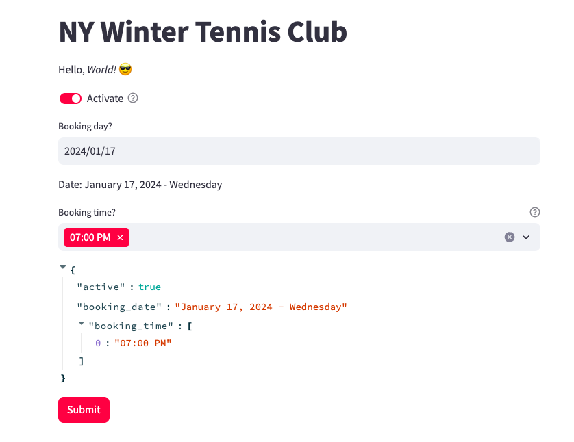

# TennisBookingSystem
Booking tennis courts during the winter season can be challenging. To address this issue, I used Selenium to automate the booking of courts via the Chrome browser and a cron scheduler. Additionally, I utilized Streamlit, a Python UI module, for selecting reservation times and courts.

# How to run? 

### Server run with every 30 min
crontab -l
- #*/30 * * * * python demo_run.py

### UI run for settings the booking 
- streamlit run main.py

